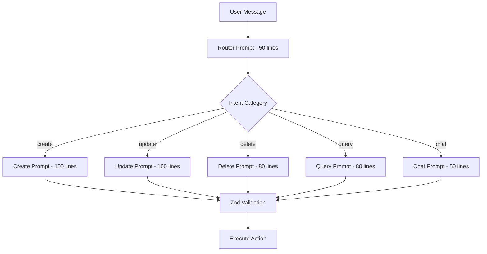

# AI Accuracy Improvements - Final Review & Testing

**Date:** January 2026  
**Version:** 1.0  
**Status:** Implementation Complete

---

## Executive Summary

This document details the comprehensive AI accuracy improvement project completed for the Personal AI Assistant (Asteron) app. Six key improvements were implemented targeting the most critical issues identified in the deep analysis ([`plans/ai-service-accuracy-analysis.md`](../../plans/ai-service-accuracy-analysis.md)).

### Expected Impact

| Improvement | Severity Addressed | Expected Outcome |
|-------------|-------------------|------------------|
| Priority Label Bug Fix | 🟡 Medium | Medium priority items now display correctly |
| Temperature Configuration | 🟠 High | Deterministic, consistent AI outputs |
| Contradictory Instructions Fix | 🔴 Critical | Predictable item creation behavior |
| Context Optimization | 🟠 High | ~96% token reduction, faster responses |
| lastMentionedItem Tracking | 🟡 Medium | Quick actions work correctly |
| Zod Schema Validation | 🟠 High | Graceful error handling, no runtime crashes |

---

## Changes Made

### 1. Priority Label Bug Fix

**File:** [`app/(tabs)/capture.tsx`](app/(tabs)/capture.tsx:207)

**Problem:** The `getPriorityLabel()` function checked for `'medium'` but the `ItemPriority` type uses `'med'`.

**Change:** Line 207
```typescript
// Before
case 'medium': return '(Medium)';

// After
case 'med': return '(Medium)';
```

**Impact:** All medium-priority items now correctly display "(Medium)" in the schedule context sent to the AI.

---

### 2. Temperature Configuration

**File:** [`src/ai/aiService.ts`](src/ai/aiService.ts)

**Problem:** No temperature parameter was set for API calls, causing non-deterministic outputs for JSON extraction tasks.

**Changes:**

| Function | Line | Change |
|----------|------|--------|
| [`transcribeAudio()`](src/ai/aiService.ts:609) | 609 | Added `temperature: 0` |
| [`analyzeText()`](src/ai/aiService.ts:785) | 785 | Added `temperature: 0` |
| [`analyzeIntent()`](src/ai/aiService.ts:1325) | 1325 | Added `temperature: 0` |

**Note:** [`processFollowUpAnswer()`](src/ai/aiService.ts:1421) does not have temperature set as it requires some flexibility for natural language parsing.

**Impact:** JSON responses are now deterministic and consistent across identical inputs.

---

### 3. Contradictory Instructions Fix

**File:** [`src/ai/aiService.ts`](src/ai/aiService.ts:1164)

**Problem:** The prompt contained contradictory instructions:
- Line 909: "GOLDEN RULE: NEVER ASSUME - ALWAYS ASK"
- Line 860: "DEFAULT to creating items without asking questions - users prefer speed"

**Change:** Line 1164 (previously ~860)
```typescript
// Before
"6. DEFAULT to creating items without asking questions - users prefer speed over perfection"

// After
"6. Create items confidently when all essential info is present (title + type). Ask only when truly missing critical info."
```

**Impact:** Clear guidance for AI behavior - create when sufficient info exists, ask only when truly necessary.

---

### 4. Context Optimization

**File:** [`app/(tabs)/capture.tsx`](app/(tabs)/capture.tsx:199)

**Problem:** Schedule expansion used 365 days, wasting tokens and diluting relevant context.

**Changes:**

| Line | Change |
|------|--------|
| 199 | `expandRepeatingItems(..., 365)` → `expandRepeatingItems(..., 14)` |
| 258 | Context label updated to "Next 14 Days" |

**Calculation:**
- Before: Daily task = 365 context lines
- After: Daily task = 14 context lines
- **Token reduction: ~96%**

**Impact:** Faster AI responses, more focused context, reduced API costs.

---

### 5. lastMentionedItem Tracking

**File:** [`app/(tabs)/capture.tsx`](app/(tabs)/capture.tsx)

**Problem:** The `lastMentionedItem` state was not being updated in all intent handlers, breaking quick_action functionality.

**Changes Added:**

| Intent Case | Lines | Tracking Added |
|-------------|-------|----------------|
| `create` | 305-308 | `setLastMentionedItem(createdItem)` and `setLastCreatedItem(createdItem)` |
| `batch_create` | 392-400 | `setLastCreatedItem(lastCreated)` for the last item in batch |
| `update` | 427 | `setLastMentionedItem(matchingItem)` before update |
| `delete` | 478 | `setLastMentionedItem(matchingItem)` before deletion |
| `delete_occurrence` | 515, 525 | `setLastMentionedItem(matchingItem)` |

**Impact:** Quick actions like "Done", "Snooze", and "Tomorrow" now work correctly by referencing the last mentioned item.

---

### 6. Zod Schema Validation

**File:** [`src/ai/aiService.ts`](src/ai/aiService.ts:14)

**Problem:** No validation of AI responses before use, leading to potential runtime errors.

**Changes Added:**

#### Schema Definitions (Lines 14-174)

| Schema | Purpose |
|--------|---------|
| [`AIAnalysisResultSchema`](src/ai/aiService.ts:14) | Validates text analysis responses |
| [`ChatIntentResultSchema`](src/ai/aiService.ts:30) | Validates intent analysis responses |
| [`FollowUpAnswerResultSchema`](src/ai/aiService.ts:179) | Validates follow-up answer responses |

#### Validation Functions with Safe Fallbacks

| Function | Lines | Fallback Behavior |
|----------|-------|-------------------|
| [`safeParseAIAnalysisResult()`](src/ai/aiService.ts:203) | 203-234 | Returns note with low confidence |
| [`safeParseChatIntentResult()`](src/ai/aiService.ts:241) | 241-268 | Returns chat intent with clarification request |
| [`safeParseFollowUpAnswerResult()`](src/ai/aiService.ts:274) | 274-304 | Marks as complete with existing data |

**Key Design Decision:** All validation functions have graceful fallbacks - they **never throw errors**. This ensures the app remains functional even when AI returns malformed responses.

**Impact:** Robust error handling, no more silent failures or runtime crashes from malformed AI responses.

---

## Testing Checklist

### Priority Label Bug Fix
- [ ] Create an item with medium priority
- [ ] Verify "(Medium)" appears in debug context (`/debug` command)
- [ ] Confirm AI recognizes medium priority items in schedule queries

### Temperature Configuration
- [ ] Run the same transcription request 3 times - verify identical outputs
- [ ] Run the same text analysis 3 times - verify identical JSON structure
- [ ] Run the same intent analysis 3 times - verify consistent intent classification

### Contradictory Instructions Fix
- [ ] Say "add grocery shopping" - AI should ask for clarification (type unclear)
- [ ] Say "remind me to call mom at 3pm" - AI should create immediately (clear type)
- [ ] Say "pay rent on the 1st" - AI should create immediately (bill type clear)
- [ ] Say "add something" - AI should ask what to add

### Context Optimization
- [ ] Run `/debug` command - verify schedule shows only 14 days
- [ ] Add a daily repeating task - verify it appears 14 times (not 365)
- [ ] Verify AI response time is noticeably faster
- [ ] Check API usage/costs for reduced token consumption

### lastMentionedItem Tracking
- [ ] Create a task, then say "Done" - should complete the created task
- [ ] Update a task's time, then say "Snooze" - should snooze that task
- [ ] Delete a task, then say "Done" - should show error (deleted item)
- [ ] Create multiple items, say "Done" - should complete the last one
- [ ] Query "what's tomorrow", then say "Done" - should ask for clarification

### Zod Schema Validation
- [ ] Test with malformed JSON response (mock API) - should not crash
- [ ] Verify fallback messages appear in chat
- [ ] Check console logs for validation error details
- [ ] Test edge cases: empty response, missing required fields, wrong types

### Integration Tests
- [ ] Full conversation flow: create → update → complete → delete
- [ ] Voice input → transcription → intent → action flow
- [ ] Multi-turn clarification conversation
- [ ] Batch operations (create/delete multiple items)

---

## Future Enhancements (Phase 2)

Based on the analysis in [`plans/ai-service-accuracy-analysis.md`](../../plans/ai-service-accuracy-analysis.md), the following architectural improvements are recommended for Phase 2:

### Prompt Architecture Redesign: Router + Action Pattern

The current 420-line `analyzeIntent` prompt should be split into focused, specialized prompts:



**Benefits:**
- Each prompt under 200 lines (vs current 420)
- Reduced instruction drift
- Easier maintenance and testing
- Better accuracy per intent type

### Simplified Intent Types

Reduce from 20+ intent types to 8 with modifiers:

```typescript
interface AIIntentResult {
    category: 'create' | 'modify' | 'remove' | 'query' | 'converse';
    scope: 'single' | 'multiple' | 'conditional';
    targetType?: 'occurrence' | 'series';
    // ... other fields
}
```

### Smart Context Builder

```typescript
function buildContext(items: Item[], query: string): string {
    // 1. Always include overdue items
    // 2. Include next 14 days only  
    // 3. Include items matching query keywords
    // 4. Limit total to 100 items
}
```

### Additional Improvements for Phase 2
- Extract shared date/time logic to utility function
- Add embedding-based similarity matching (vs Levenshtein)
- Implement structured error responses with severity levels
- Add prompt injection protection
- Cache expanded schedule in state

---

## Rollback Instructions

### 1. Priority Label Bug Fix
**File:** `app/(tabs)/capture.tsx` line 207
```typescript
// Revert to:
case 'medium': return '(Medium)';
```

### 2. Temperature Configuration
**File:** `src/ai/aiService.ts`
- Remove `temperature: 0` from lines 609, 785, 1325

### 3. Contradictory Instructions Fix
**File:** `src/ai/aiService.ts` line 1164
```typescript
// Revert to:
"6. DEFAULT to creating items without asking questions - users prefer speed over perfection"
```

### 4. Context Optimization
**File:** `app/(tabs)/capture.tsx`
- Line 199: Change `14` back to `365`
- Line 258: Update label back to "Next 30 Days"

### 5. lastMentionedItem Tracking
**File:** `app/(tabs)/capture.tsx`
- Remove `setLastMentionedItem()` calls from lines 305-308, 427, 478, 515, 525
- Remove `setLastCreatedItem()` calls from lines 305-308, 392-400

### 6. Zod Schema Validation
**File:** `src/ai/aiService.ts`
- Remove lines 4-304 (import and schema definitions)
- Revert `safeParseAIAnalysisResult(cleanContent)` to `JSON.parse(cleanContent)` at line 811
- Revert `safeParseChatIntentResult(cleanContent)` to `JSON.parse(cleanContent)` at line 1349
- Revert `safeParseFollowUpAnswerResult(cleanContent, pendingData)` to `JSON.parse(cleanContent)` at line 1448

---

## References

- **Analysis Document:** [`plans/ai-service-accuracy-analysis.md`](../../plans/ai-service-accuracy-analysis.md)
- **AI Service:** [`src/ai/aiService.ts`](src/ai/aiService.ts)
- **Capture Screen:** [`app/(tabs)/capture.tsx`](app/(tabs)/capture.tsx)

---

*Document generated: January 2026*